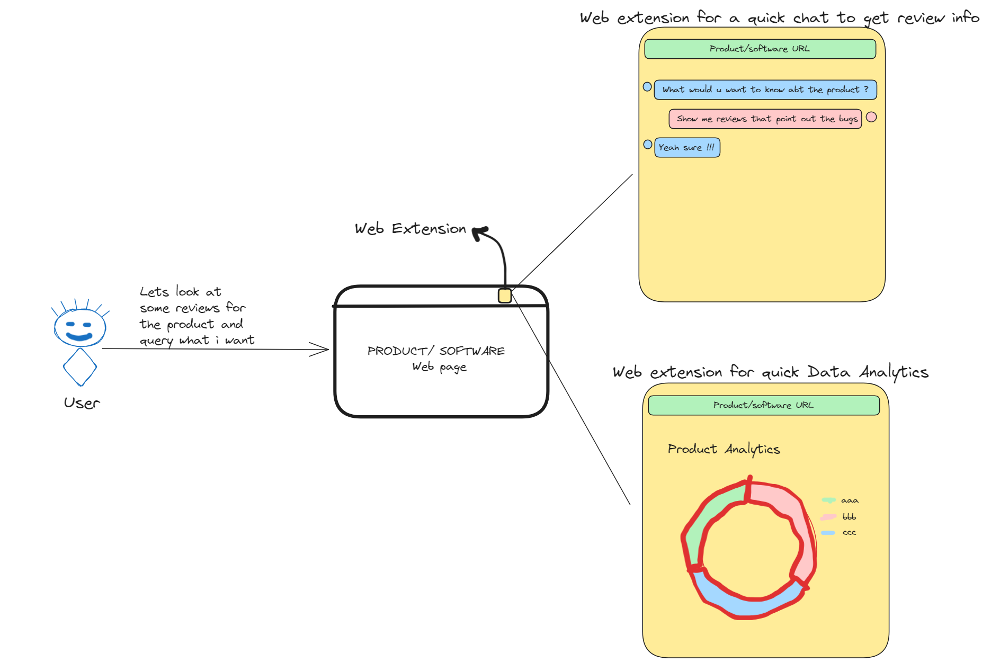
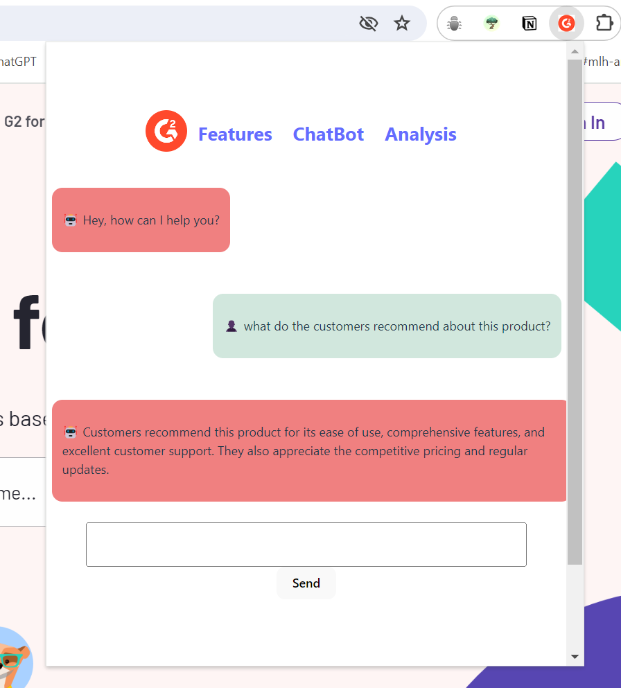
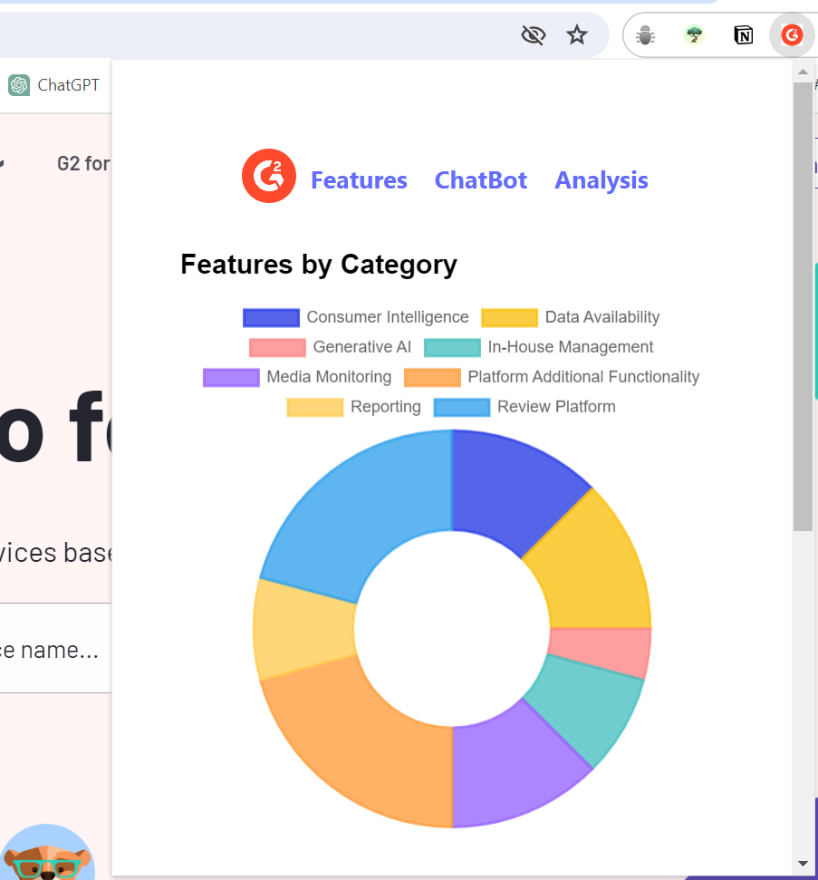
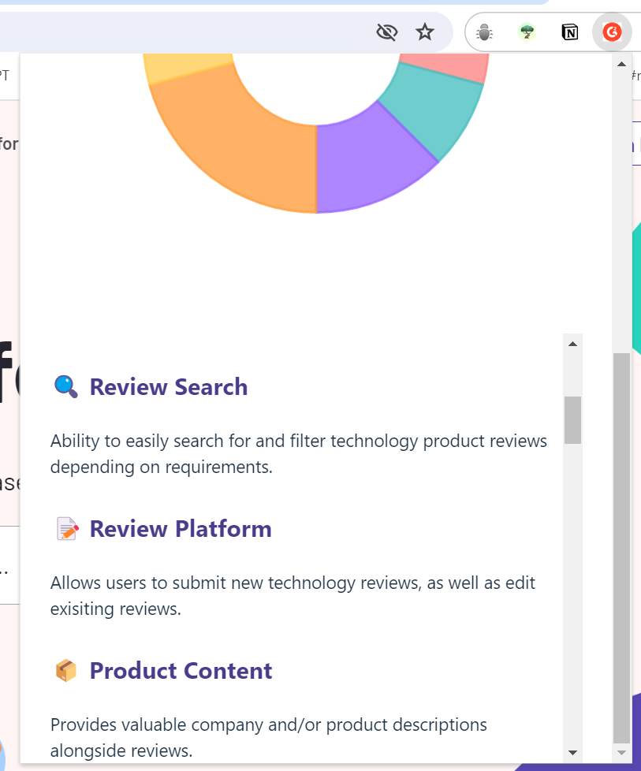
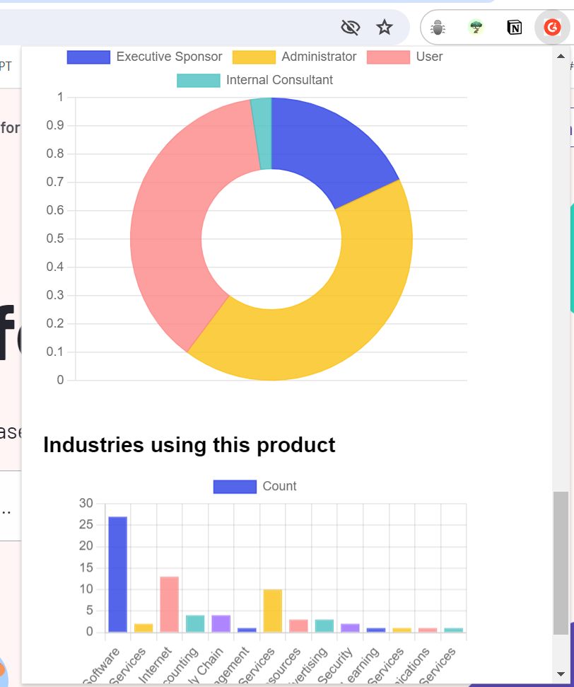

# G2_Project
---

## Problem Statement 
G2 has more than 2.5 million reviews for various products and services. These reviews help
both buyers and software vendors in decision-making. One interesting aspect of the
review data that we want to solve is to list the exact feature sets the customers are looking
for. A few examples include application performance, the overall user experience, missing
functionality, bugs, etc.
As an aspiring Computer Science graduate, we would like you to develop a system that
analyses the review data for a particular product from G2 using the API provided below and
provides a list of feature sets that the customers are looking for.
Here's the API endpoint that you can use:

https://data.g2.com/api/docs#reviews-list - You can use this batch API to fetch reviews of
G2 Marketing solutions in a batch of 100 using the page[size] param. Once you have
accumulated all reviews, use an algorithm to find the customer asks. The results can be
printed on the console.

## Proposed Solution 


By integrating the robust features of a Chrome extension, an AI-powered chatbot, and G2's comprehensive API endpoints, users can effortlessly access and analyze G2 reviews to pinpoint customer requests for a wide array of products and services. This all-encompassing solution approach harnesses advanced technologies such as Natural Language Processing (NLP) and conversational AI to deliver actionable insights, thereby facilitating informed decision-making. Additionally, it showcases the powerful features of G2, providing a holistic view of customer feedback. 🚀

### Video recording 
https://www.loom.com/share/602187cedf364587acacbe81abf2e4c8?sid=dd87f673-5b79-4ad5-b8d1-cb84b44c505c

## How to run?

``` git clone https://github.com/amulyamarali/G2_Project.git```

open the folder in your favourite IDE


1) To build the extension 
```bash 
cd frontend
npm install
npm run build
```
once the ```dist``` folder is created, follow the below steps: 

**Chrome extension settings > Toggle the Developer Mode > Load unpacked > Add the `dist` folder of this project**

If the steps are correctly followed then should be able to see the **G2 logo** in your extensions bar


2) To run the server

```bash
cd ..
cd backend
pip install -r requirements.txt
python server.py
```
Don't forget to add your own `.env` with **openai api key** and the **secret token** in the `backend` folder.

If the `server.py` runs fine then you should be able to see `Running on http://127.0.0.1:3000` in the terminal. 


### Now you can start using this extension !!!


## Output
### 1) For the **Chatbot**



### 2) For the **Features**





### 3) For the **Analysis**


